# 안녕하십니까 yuta.jeong(정형륜) 👋
<picture>
  <source media="(prefers-color-scheme: dark)" srcset="dist/defense-dark.svg">
  
</picture>
**WEB/APP Developer · JAVA**

코코아와 캐시맵에서 6년 7개월 동안 전자증빙을 고객사 그룹웨어에 붙여 왔습니다.  
화면만 그리지 않고, 회사가 바뀌어도 증빙이 실제로 돌아가게 만드는 일을 해 왔습니다.

## 🤖 Currently What I Work on

| Project | What it does | Impact |
|---|---|---|
| [yuta_logagent](https://github.com/hrunj1230/yuta_logagent) | Git·대화 로그를 날짜로 모아 하루 일지를 쓰는 LangGraph 에이전트 | 요청당 과금 토큰 **11,742 → 531** |
| [Yuta_Chat_Bot](https://github.com/hrunj1230/Yuta_Chat_Bot) | 로컬 마크다운을 근거로 답하는 RAG API | 문서 근거 질의응답 |
| [claude-daily-log](https://github.com/hrunj1230/claude-daily-log-marketplace) | Claude 대화를 날짜별 마크다운 일지로 남기는 스킬 | 원본 덤프 없이 결정·산출물만 요약 |

## 💼 Experience Highlights

**카카오테크 부트캠프 · AI 실무개발** *(2026.05.12 – 2026.11.17)*  
- 현장에서 만든 WEB/APP 위에 에이전트를 얹는 일을 배우고 있습니다

**WEB/APP Developer @ 캐시맵 주식회사** *(2025.03 – 현재)* · 대리  
- JAVA로 전자증빙·명함관리를 고객사 그룹웨어에 연동 (한국마이콤, 나비서)
- 일신하이폴리 ERP 구축 (2025.12 – 2026.04): Node · React · Python · DB2

**WEB/APP Developer @ 주식회사 코코아** *(2019.11 – 2025.02)* · 대리  
- 캐시맵 솔루션 개발 후 아웃백·BHC·쇼박스·클래시스 전자증빙을 그룹웨어에 연동
- 고객사 시스템이 달라도 증빙 업무가 끊기지 않게 맞추는 일을 반복했습니다

**부천대학교 컴퓨터소프트웨어공학과** · 학사  
- 기술등급 중급 · 총 경력 6년 7개월

## 🛠️ Stack

**Languages**

**AI / LLM**

**Backend & Frontend**

**Infra & Tools**

## 📬 Let's connect

